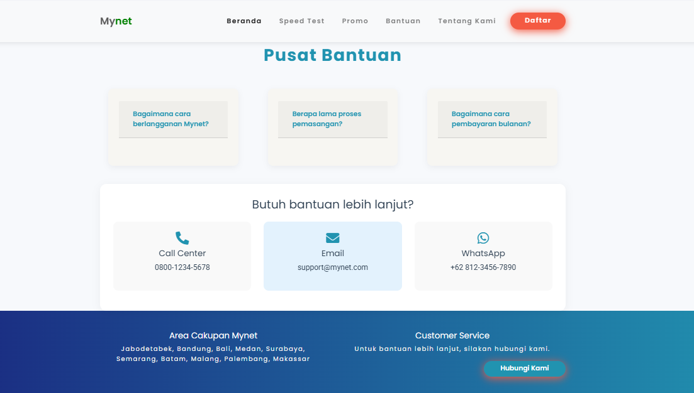

# HTML Template Provider ISP

Template / Landing Page Penjualan ISP (Internet Service Provider)
Digunakan untuk mempromosikan produk yang berupa ISP, dengan berbagai kecepatan internet yang tersedia didalamnya.

## 🌟 Fitur Terbaru

### 1. Speed Test & Network Information

- Pengukuran kecepatan download secara real-time
- Pengukuran latency (ping)
- Grafik hasil test kecepatan
- Informasi detail perangkat
- Informasi jaringan dan ISP
- Penyimpanan hasil test otomatis

### 2. Landing Page

- Desain modern dan responsif
- Informasi paket layanan
- Promo dan penawaran khusus
- Form pendaftaran pelanggan baru

### 3. Paket Internet

- Pilihan berbagai paket kecepatan
- Detail harga dan fitur
- Perbandingan paket

### 4. Fitur Bantuan

- Panduan penggunaan
- FAQ (Frequently Asked Questions)
- Kontak customer service

## 📱 Tampilan Responsive

### Desktop View( Bukan yang terbaru )

### Mobile View( Comming Soon)

## 🔧 Teknologi yang Digunakan

- HTML5
- CSS3 & Bootstrap
- JavaScript (ES6+)
- Chart.js untuk visualisasi data
- API Integration untuk speed test

## ⚡ Speed Test Features

1. **Device Information**

   - Browser detection
   - Operating System detection
   - Screen resolution

2. **Network Information**

   - IP Address
   - Connection Type
   - Download Speed
   - Latency Testing
   - ISP Detection
   - Location Information

3. **Real-time Testing**
   - Progress bar visualization
   - Live speed measurements
   - Interactive graph display
   - Automatic result saving

## 🎯 Update Terbaru

- Penambahan fitur speed test
- Perbaikan tampilan responsif
- Penambahan grafik performa
- Sistem penyimpanan hasil test otomatis
- Perbaikan UI/UX secara menyeluruh

## 📝 Cara Penggunaan Speed Test

1. Klik tombol "Start Speed Test"
2. Tunggu proses pengukuran selesai
3. Lihat hasil test di grafik
4. Hasil akan otomatis tersimpan jika diizinkan

## 🔗 Pemilik Asli

https://rasyidmisbahuddin.github.io/providerHTML/

## 📸 Screenshot Sections

   
   

### Form Pendaftaran

### Halaman Promo

### Speed Test Results

### Customer Support

